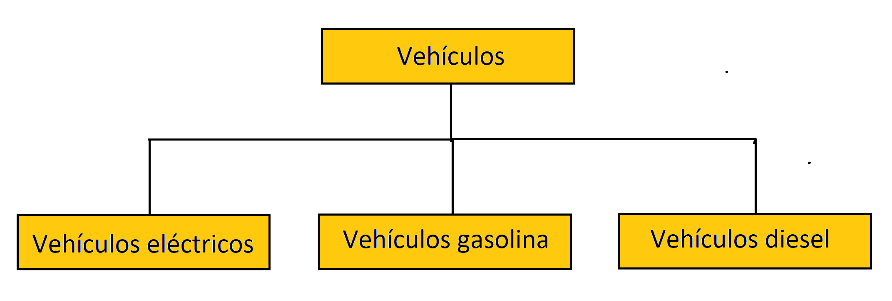

# Tarea para prueba tecniva 12 leguas

Proyecto desarrollado con **Spring Boot 3.2.5** y **JAVA 21**. Se utilizó **Docker** para la base de datos **PostgreSQL** y para el despliegue de la API.

## Contenido

Para el modelado de las entidades JPA se utilizó una estrategia de herencia tipo JOINED

Se ofrece una coleccion de **Postman** para las pruebas de las API.

**apiDoc url**: http://localhost:8088/swagger-ui/index.html